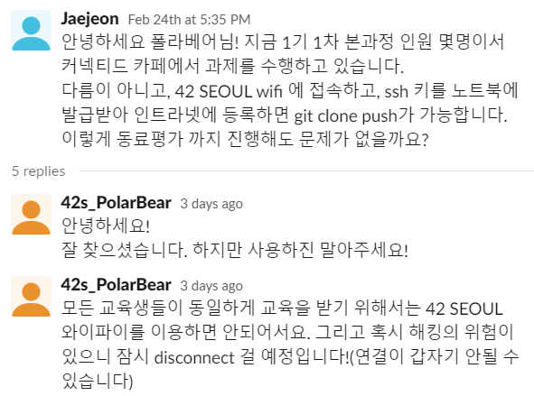

# 2020 02 24 학습 레포트

### 학습 날짜 

2020-02-24(월)

### 학습시간 

15:00 ~ 19:00 (개포동 커넥티드 카페)

### 학습 범위 및 주제 

Libft subject 확인 및 노트북에 환경설정

### 동료 학습 방법 

커넥티드 카페에서 동료들과 함께 학습

참여 인원: kchoi, dyun, hycho, jjo

### 학습 목표

Libft 프로젝트를 수행하기 위해 subject 분석 및 노트북 환경 설정

### 과제 제출 repository 주소

환경 설정 위주로 진행 했기 때문에 Repository는 생성하지 않았음.

### 상세 학습 내용

- 15:00 ~ 19:00 까지 **4시간** 정도 학습

- Mac os가 없어서 Window 환경에서 wsl + zsh + hyper +vim 조합으로 최대한 mac os 환경과 비슷하게 설정

-  [예쁜 터미널 Hyper 사용기](https://jaewoook.github.io/blog/review/terminal/2017/10/17/예쁜-터미널,-Hyper-사용기.html) 

- 커넥티드 카페에서 42 SEOUL wifi에 연결하고, SSH키를 새로 발급받고 인트라넷에 등록하면, 인트라넷에서 git repository에 접근 권한이 생기는 이슈를 찾아냈다. 즉, 클러스터가 아니여도 개포동 디지털 혁신파크 근처 42 SEOUL wifi를 이용할 수 있는 어느 곳에서든 접근이 가능하다.

- 그렇다면, 이 방법을 통해서 클러스터에 가지 않아도, 과제를 제출 하고 우리끼리 동료 평가 또한 가능 하다는 것이다. 이 이슈를 발견해서 스태프 분들께 문의를 보냈고 모든 교육생들과의 형평성, 해킹의 위험 가능성 때문에 하지 말라는 답변을 받았다.

  

### 학습 내용에 대한 개인적인 총평 (최소 5줄 이상)

42 SEOUL 본과정에 대한 기대를 많이 하고 있었는데 온라인 학습으로 하게 되어 매우 아쉬웠다.

그래서 근처에 살고 있는 몇 명의 교육생들과 모여서 학습하기로 했고 과제가 발표되는 당일 커넥티드 카페에서 만나 학습하기로 했다. 어느 정	도 예상한대로 학습 과제는 42 Cursus 내에 있는 프로젝트였고 수행 방식만 온라인으로 바뀐 것이었다.

오프라인에서는 교육장에 있는 iMac 을 사용했는데, 이제는 사용할 수 없어서 노트북에 최대한 비슷한 환경을 구성하려고 노력했다. 

macos를 가상머신에 설치할지, 리눅스를 설치해서 사용할지, wsl에서 간단한 환경을 설정해 사용할지 고민을 많이 했는데 결국 가장 익숙한 wsl에서 하기로 결정하고 설정을 하기 시작했다.

하지만 최대한 비슷하게 하기는 힘들었고, 설정을 하면 할 수록 조금씩 더 마음에는 테마나 플러그인들을 알게 되어 자꾸만 고쳐나가고 있었다. 환경 설정을 꼭 마무리 지어 내일 부터는 본격적인 libft 프로젝트를 수행하고 싶다.

### 다음 학습 계획 (최소 5줄 이상)

환경 설정을 마무리 짓고, Libft subject도 다시 한번 읽고 라이브러리 구현을 시작해야겠다.